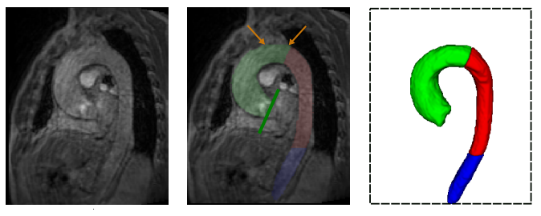
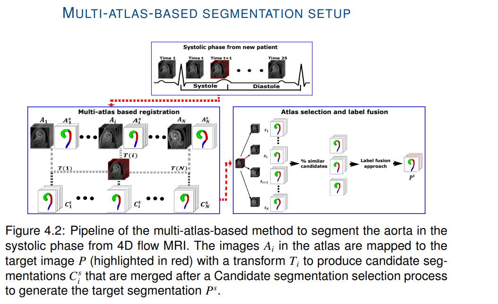
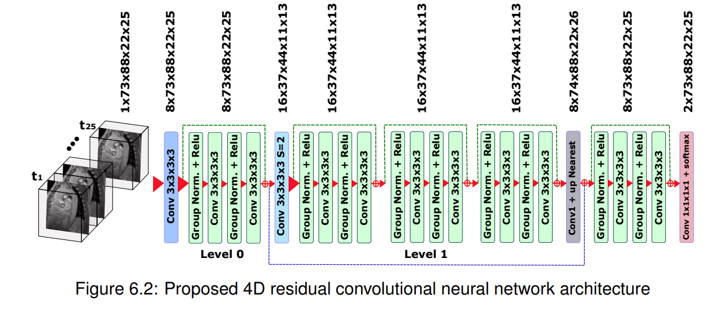

# 4D Flow MRI Segmentation
4DFlowMRI _Segmentation is a repository containing deep learning models for 3D and 4D segmentation from 4D flow MRI. In particular, the segmentation of the aorta artery is addressed. In addition, it contains a code for 3D segmentation based on a multi-atlas approach. The aorta is segmented from the magnitude images (anatomical) provided by 4D flow MRI. 



## 3D segmentation of the aorta

### Multi-atlas based segmentation

Segmentation based on multi-atlas is performed using the slight-one-patient out strategy. Thus, to segment each patient in the atlas, the rest of the patients are used as atlases. Images must be stored as follows.

```
├── Patient1
│   ├── P1GRAY.nii
│   └── P1MASK.nii.gz
│  
├── PatientN

```

Image segmentation based on multi-atlas involves several steps Fig2. Using `BinaryWeightedMajorityVotingMETRICS.py` the label fusion process can be performed to compute locally and globally the Hausdorff distance and Dice scores between the manual and automatic segmentations. For more details refer to the paper [Segmentation of the aorta in systolic phase from 4D flow MRI: multi-atlas vs. deep learning](https://link.springer.com/article/10.1007/s10334-023-01066-2)



### Deep learning based segmentation
For the 3D segmentation based on deep learning, a Unet like neural network was used. The model can be executed using `main.py` in `3D_DeepLearning`. The database must be stored as follows.

```
├── Images
│   ├── P1GRAY.nii
│   └── P1MASK.nii
│  
├── Masks
│   ├── P1GRAY.nii.gz
│   └── P1MASK.nii.gz

```

## 4D segmentation of the aorta

### 4D segmentation based on 3D model

The 4D segmentation of the aorta can be approached with a 3D model, independently segmenting each frame of the 4D image. For this purpose the codes in [`Model3DtoSegmentation4D`](4D_DeepLearning/Model3DtoSegmentation4D). Details of the use of this approach in 4D segmentation of the aorta can be found in the paper [4D segmentation of the thoracic aorta from 4D flow MRI using deep learning](https://www.sciencedirect.com/science/article/pii/0730725X22002363).

### 4D segmentation based on 4D model

The 4D segmentation of the aorta from 4D flow MRI is approached with a proposed 4D CNN model. The 4D model built in-house (Fig.3) is in [4D_DeepLearning](4D_DeepLearning)



